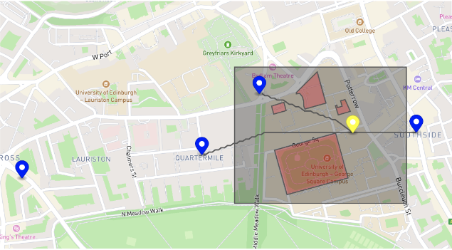

# PizzaDronz
Welcome to PizzaDronz.\
This is a drone system that helps deliver pizzas to students who are working hard in the Appleton Tower (UoE, Edinburgh, UK).\
You can simply run the following command in cmd to start the system.
```
java -jar ilp/target/PizzaDronz-1.0-SNAPSHOT.jar [YOURSERVER] [DATE] 
```
NOTE:\
**You must have jdk-18 or above.**\
**The information stored in your server must be written in JSONArray or a single JSON.**\
**Your Date should be in the form of YYYY-MM-DD**\
\
The result is like:\

| Score table | Score |
| :---: | :---: |
| Coursework-1 | 23.5/25 |
| Coursework-2 | 61.75/75 |
| Overall      | 85.25/100 |
